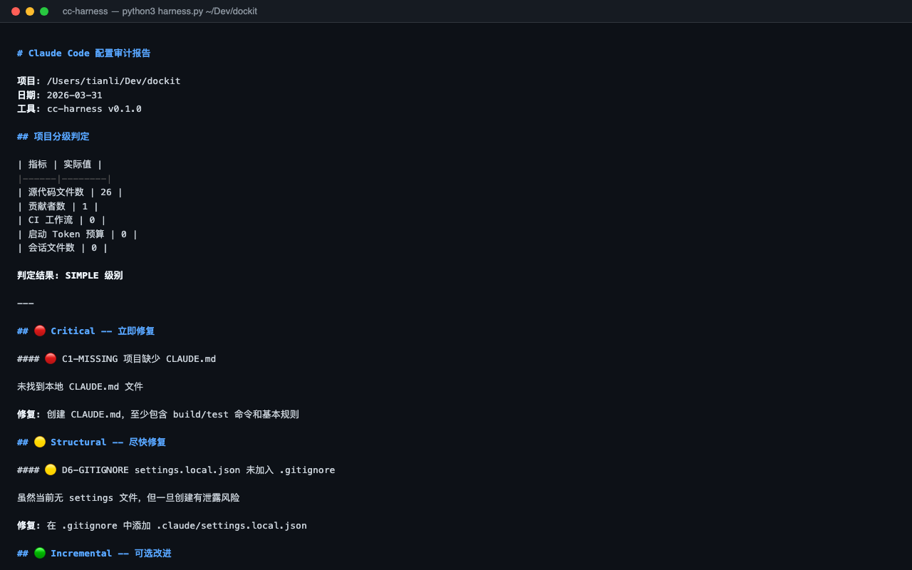

# cc-configs

**English** | [中文](README_CN.md)

The single source of truth for all Claude Code customizations — slash commands, auto-triggered skills, agent definitions, rules, and CLI tools (audit + context monitoring), managed as code and symlinked into `~/.claude/`.

[](LICENSE)
[](https://python.org)

---



---

## What is this?

| Layer | What | Where |
|-------|------|-------|
| **Commands** | 19 active slash commands + 12 archived | `commands/` |
| **Skills** | 14 auto-triggered context injections | `skills/` |
| **Agents** | 2 specialized agent definitions | `agents/` |
| **Rules** | Command rule files | `rules/` |
| **Harness tool** | 6-dimension config quality scanner | `tools/harness/` |
| **Context tool** | Token monitor, snapshot, health check | `tools/context/` |
| **Stats tool** | Command usage frequency tracker | `tools/cmd_stats.py` |

`install.sh` symlinks `commands/`, `skills/`, and `agents/` into `~/.claude/`, so Claude Code picks them up automatically across all projects.

## Install

```bash
git clone https://github.com/zengtianli/cc-configs.git ~/Dev/tools/cc-configs
cd ~/Dev/tools/cc-configs
bash install.sh
```

This creates symlinks:

```
~/.claude/commands  → ~/Dev/tools/cc-configs/commands
~/.claude/skills    → ~/Dev/tools/cc-configs/skills
~/.claude/agents    → ~/Dev/tools/cc-configs/agents
```

Update by pulling the repo — symlinks keep everything in sync.

---

## Commands Reference

Commands are slash commands invoked as `/command-name [args]` in Claude Code. Each command encodes a repeatable workflow as a prompt.

### Ship & Deploy

| Command | Usage | Description |
|---------|-------|-------------|
| `/ship` | `/ship`, `/ship all` | Commit + push one or more repos. Auto-generates conventional commit messages. |
| `/deploy` | `/deploy` | Deploy current project to VPS. Detects `deploy.sh`, builds frontend if needed. |
| `/pull` | `/pull`, `/pull all` | Batch `git pull --ff-only` for one or more repos. |
| `/dashboard` | `/dashboard`, `/dashboard --scan-only` | Scan Claude Code sessions with LLM analyzer, then deploy the dashboard app. |
| `/scan` | `/scan` | Scan Claude Code sessions, analyze task status with LLM, generate `tasks.json`. |

### Repo Management

| Command | Usage | Description |
|---------|-------|-------------|
| `/groom` | `/groom`, `/groom --check` | Full repo maintenance pipeline: pull → audit → fix → review → push. |
| `/audit` | `/audit`, `/audit hydro-risk` | Audit repo integrity against `repo-standards.json`. |
| `/promote` | `/promote`, `/promote all --check` | GitHub metadata audit: description, topics, homepage, screenshots. |
| `/repo-map` | `/repo-map scan`, `/repo-map show` | Manage the GitHub ↔ local path registry (`repo-map.json`). |

### Document Processing

| Command | Usage | Description |
|---------|-------|-------------|
| `/md2word` | `/md2word path/to/file.md` | MD/DOCX → Word pipeline: template styling → text formatting → image caption centering. |
| `/review` | `/review path/to/report.docx` | Review a Word document. Default: formatting check. `--deep`: 4-dimension LLM review. `--all`: both passes. |

### Migration & Build

| Command | Usage | Description |
|---------|-------|-------------|
| `/migrate` | `/migrate capacity` | Port a Python/Streamlit app to Tauri desktop (Rust backend + React frontend). |

### Scaffolding

| Command | Usage | Description |
|---------|-------|-------------|
| `/harness` | `/harness`, `/harness ~/Dev/new-project` | Detect project type and maturity stage, generate or upgrade Claude Code config. |

### Session & Workflow

| Command | Usage | Description |
|---------|-------|-------------|
| `/recap` | `/recap` | End-of-session retrospective: review conversation, extract lessons, update memory. |
| `/handoff` | `/handoff` | Session wrap-up: recap + config upgrade + handoff file generation in one step. |
| `/context` | `/context monitor`, `/context health` | Monitor session health — token usage, tool call distribution, context bloat detection. |
| `/tidy` | `/tidy`, `/tidy ~/Work/docs` | Deep-clean a directory: find garbage files, version chains, misplaced files. |
| `/health` | `/health` | File hygiene + git status check. Can invoke `/tidy` for cleanup. |
| `/cmd-stats` | `/cmd-stats`, `/cmd-stats --days 7` | Show slash command usage frequency from session transcripts. |

### Archived Commands

12 commands moved to `commands/archive/` (zero usage or superseded). Still accessible via `archive:name` prefix:

`auggie-map` · `build-hydro` · `cf-dns` · `fix-printer` · `gen-report` · `migrate-hydro` · `prep-basic-info` · `prep-ecoflow-calc` · `prep-engineering` · `review-deep` · `review-docx` · `vps-status`

---

## Skills Reference

Skills are auto-triggered context injections. Claude Code loads skill knowledge automatically when it detects a matching scenario — no manual invocation needed.

### Global Skills (active in all projects)

| Skill | Trigger | Knowledge provided |
|-------|---------|-------------------|
| **context** | Working in ZDWP hydro company projects | Corporate structure, county lists, data field specs, delivery standards |
| **structure** | Organizing files, creating new projects | Directory naming rules, file classification rules, auto-organization logic |
| **plan-first** | Batch operations, destructive actions | Enforces "plan before execute" discipline — show table, wait for approval |
| **quarto** | Converting DOCX to Quarto projects | Quarto build workflow, template structure, figure handling |
| **frontend** | Building UIs | Information density, compact layout, actionable data, Streamlit conventions |

### Project-specific Skills

| Skill | Bound project | Knowledge provided |
|-------|--------------|-------------------|
| **risk-map** | ~/Work/risk-map | Flood risk map data processing, QGIS spatial workflows, Excel template filling |
| **eco-flow** | ~/Work/eco-flow | Ecological flow calculation (Tennant method), reservoir screening, guarantee plans |
| **zdys** | ~/Work/zdys | Zhedong diversion operational status, dispatch models, irrigation demand calculation |
| **water-src** | ~/Work/water-src | Drinking water source safety assessment methodology |
| **water-quality** | (standalone) | Qiandao Lake diversion classified water supply management |
| **resources** | risk-map, eco-flow, zdys, water-src | Shared resource catalog: reservoir DB, GIS basemaps, admin boundaries, water resource yearbooks |

### Tool Skills

| Skill | Trigger | Knowledge provided |
|-------|---------|-------------------|
| **harness** | Checking/syncing skill config | Skill distribution registry, cross-project sync logic |
| **repo-manage** | Managing GitHub repos | Audit/screenshot/promotion SOP |
| **restart** | Terminal restart, session recovery | Session recovery instructions |

---

## Agents Reference

| Agent | Purpose |
|-------|---------|
| **bid-chapter-writer** | Write bid document chapters following company templates and formatting standards |
| **project-content-checker** | Audit project deliverable completeness against requirement checklists |

---

## CLI Tools

### Harness — Config Auditor

```bash
python3 tools/harness/harness.py /path/to/project        # Full audit
python3 tools/harness/harness.py /path/to/project --json  # JSON output
python3 tools/harness/harness.py /path/to/project --security-only
```

| Dimension | What's checked |
|-----------|---------------|
| **D1 Context** | CLAUDE.md quality, token budget, duplicates, nested files, credentials |
| **D2 Hooks** | PostToolUse coverage, schema validity, output truncation, error surfacing |
| **D3 Agents** | Skill count, overlap, description quality, frontmatter, disable-model-invocation |
| **D4 Verification** | Done-conditions, build/test commands, CI integration |
| **D5 Session** | Compact Instructions, HANDOFF.md, context budget documentation |
| **D6 Structure** | Orphan files, reference chain, naming conventions, gitignore |

### Context — Session Monitor

```bash
python3 tools/context/context.py monitor    # Token usage for latest session
python3 tools/context/context.py health     # Health check (anti-pattern detection)
python3 tools/context/context.py snapshot save
```

### Command Stats

```bash
python3 tools/cmd_stats.py                  # All-time usage
python3 tools/cmd_stats.py --days 7         # Last 7 days
python3 tools/cmd_stats.py --registered     # Only registered commands
```

## Running Tests

```bash
python3 -m pytest tools/harness/tests/ -v
python3 -m pytest tools/context/tests/ -v
```

## License

MIT
